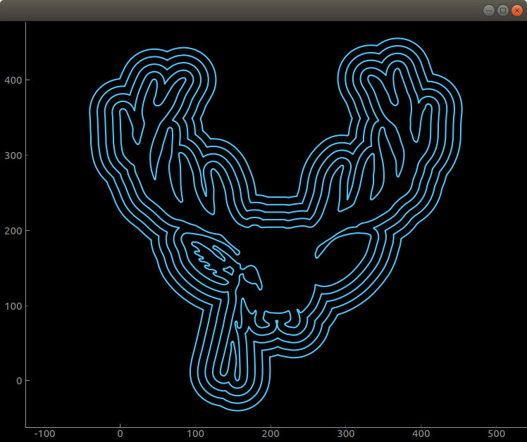

# cavaliercontours-python

A python binding for the [CavalierContours C++ library](https://github.com/jbuckmccready/CavalierContours).

<p align="center">
  
</p>

## Installation

`pip install cavaliercontours-python`

## Minimal example

```python
#!/usr/bin/env python3
import cavaliercontours as cavc

vertex_data = [[45., 30., 10., 10., 0., 0., 45.], # x
               [20., 35., 35., 50., 50., 0., 0.], # y
               [0.41421, 0., 0., 0., 0., 0., 0.]] # bulge

polyline = cavc.Polyline(vertex_data, is_closed=True)

print(polyline.is_closed())
print(polyline.vertex_count())
print(polyline.get_path_length())
print(polyline.get_area())

polyline_list = polyline.parallel_offset(delta=3.0, check_self_intersect=False)
print(polyline_list[0].vertex_data())

# ...
```
